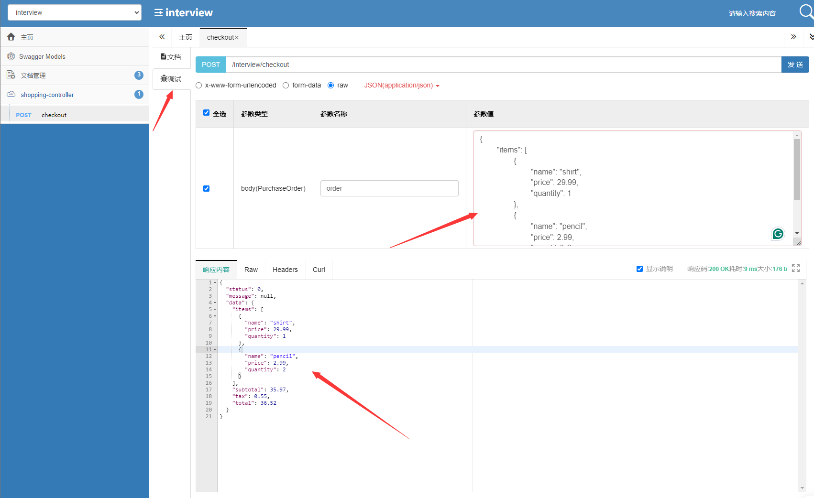

# Enhanced Comprehensive Guide to Microservice API Documentation

---

## Interactive API Exploration with Swagger UI

Effortlessly explore and interact with our meticulously detailed API documentation through the intuitive [Swagger UI](http://127.0.0.1:21000/doc.html). This interactive platform enables you to test endpoints in real-time, understand request formats, and view response samples directly from the documentation interface.

## Core Functionalities & Security Measures

Our microservice offers robust functionalities centered around calculating precise billing data derived from customers' shopping locations and item lists. To ensure secure transactions:

- **Authentication & Authorization:** All API interactions require secure authentication via JWT tokens or OAuth2. Refer to the Security Schemes section in Swagger UI for implementation details.
  
## Robust Supporting Infrastructure

For streamlined configuration and deployment, our solution includes a meticulously organized `support-files` directory:

- **Database Initialization:** The `sql` folder contains scripts to initialize and manage your database schema securely and efficiently.
  
- **Containerization & Orchestration:** Within the `deploy` folder, find Docker Compose templates and Kubernetes manifests. These artifacts simplify deploying and scaling the service across various environments, enhancing flexibility and resilience.
  
- **Deployment Workflow:** Detailed command-line instructions guide you through the deployment process, from local setup to cloud deployments, ensuring a seamless experience.

- **Configuration Data:** `taxRates.json` and `category.json` within the `files` directory store regional tax rates and product categories, respectively. Customize these as per your business requirements.

## Interface Testing and Exploration

After starting the `AdminApplication`, you can begin testing interfaces and reviewing documentation by visiting:

[Swagger UI](http://127.0.0.1:21000/doc.html)

Within the Swagger UI, you'll find the following features:

1. **API Documentation**: Comprehensive documentation for each interface, detailing its functionality, request parameters, and response structure, helping you understand how to use the APIs.
2. **Live Debugger**: Enter parameters directly in the debugging tool to execute test requests instantly, allowing you to quickly verify the correctness and performance of the interfaces.

These features streamline the process of interface validation during development and make maintenance and debugging more efficient in the long run.

## In-depth Technical Specifications & Best Practices

Delve into the intricacies of our API with the comprehensive Swagger UI documentation, which outlines:

- **Request & Response Models:** Clear definitions of payload structures for both requests and responses, aiding in accurate data formatting.
  
- **Parameters & Headers:** Essential query parameters, path variables, and required headers for each endpoint, ensuring correct usage.
  
- **Error Handling:** A dedicated section detailing possible error scenarios, HTTP status codes, and recommended actions for each error condition, promoting robust client-side error management.
  
- **Performance Optimization Tips:** Guidelines for efficient API usage, such as leveraging caching mechanisms and optimizing query parameters to minimize response times.

By adhering to these guidelines and leveraging the provided resources, developers can rapidly integrate and effectively utilize our microservices, fostering a secure and scalable application ecosystem.
